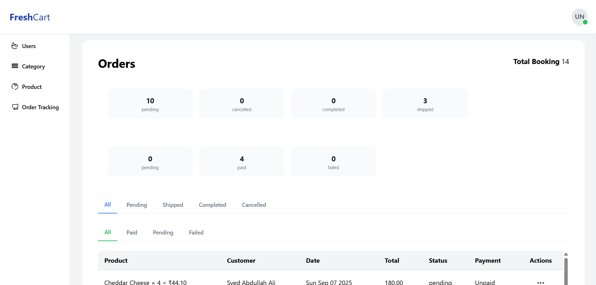

---

# Project Setup

## 🔹 Run with Docker (Recommended)

Make sure you have **Docker** and **Docker Compose** installed.

```bash
docker-compose up --build
```

This will start both the **frontend** and **backend** services.

---

## 🔹 Run Frontend Manually

1. Navigate to the frontend folder:

   ```bash
   cd frontend
   ```
2. Install dependencies:

   ```bash
   npm install
   ```
3. Start the development server:

   ```bash
   npm start
   ```

---

## 🔹 Run Backend Manually

1. Navigate to the backend folder:

   ```bash
   cd backend
   ```
2. Create and activate a virtual environment (recommended):

   ```bash
   python -m venv venv
   source venv/bin/activate   # On Mac/Linux
   venv\Scripts\activate      # On Windows
   ```
3. Install dependencies:

   ```bash
   pip install django djangorestframework django-cors-headers psycopg2-binary pillow stripe channels reportlab django-environ dj-database-url
   ```
4. Apply migrations:

   ```bash
   python manage.py migrate
   ```
5. Run the development server:

   ```bash
   python manage.py runserver
   ```

---

## Run Real-Time Server Manually
1. **Start Redis (message broker for real-time communication)**
```sh
redis-server

python -m daphne -p 9000 config.asgi:application
```
---
## Start Stripe Webhook Listener (for payment events)
```
stripe listen --forward-to http://127.0.0.1:8000/api/payment/webhook
```
## ✅ Notes

* Ensure `.env` files are configured properly for secrets, database URLs, and Stripe keys.
* Docker setup should handle most environment configuration automatically.

---


## Frontend Client landing page


## Frontend Admin landing page


